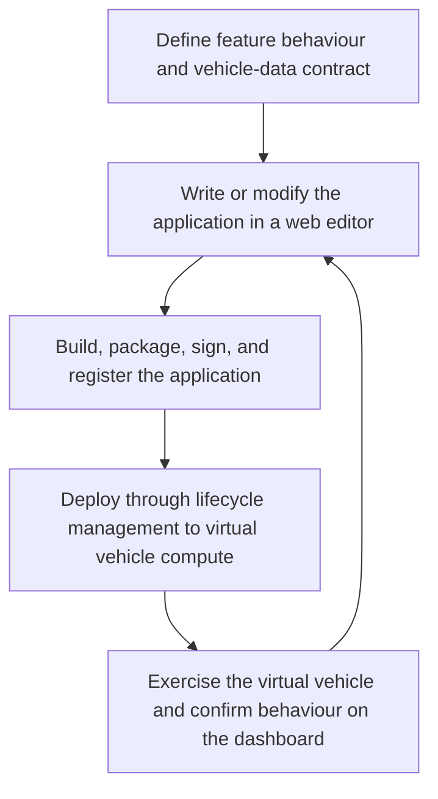

# SDV Application Prototyping Blueprint

**A reusable pattern for developing an SDV application on the web, deploying it through a managed software lifecycle to virtual vehicle compute, and observing its behaviour in a cloud dashboard.**

This blueprint defines an end-to-end prototyping workflow for Software-Defined Vehicle (SDV) applications before physical vehicle hardware is available. A developer writes or modifies an application in a web environment, builds and versions it, deploys it through a lifecycle-management platform to virtual vehicle devices, exercises it with simulated vehicle signals, confirms its behaviour through a cloud dashboard, and repeats the loop. Eclipse SDV projects provide key building blocks for vehicle-data access, distributed communication, and the development environment across this workflow.

This repository provides one working reference implementation using **digital.auto Playground** for web-based C++ authoring and dashboard visualization, **AosCloud** for application lifecycle management, **AosCore** for execution on QEMU-based virtual devices, and Eclipse KUKSA and Eclipse Zenoh for vehicle-data integration. The **EV Range Extender** is the example application used to demonstrate the blueprint.

> **Reference implementation:** digital.auto Playground + AosEdge (AosCloud and AosCore) + QEMU, demonstrated through the EV Range Extender application.

| Layer | Purpose | Representation in this repository |
|---|---|---|
| **Blueprint concept** | Defines the reusable SDV prototyping workflow | Web authoring → managed build and deployment → virtual vehicle execution → dashboard feedback → iteration |
| **Reference implementation** | Provides one concrete implementation of the blueprint roles | digital.auto Playground + AosEdge (AosCloud and AosCore) + QEMU + Eclipse KUKSA + Eclipse Zenoh |
| **Example application** | Makes the workflow observable through a vehicle feature | EV Range Extender |

## Table of Contents

- [What This Blueprint Demonstrates](#what-this-blueprint-demonstrates)
  - [The Prototyping Loop](#the-prototyping-loop)
  - [Required Blueprint Capabilities](#required-blueprint-capabilities)
  - [Eclipse SDV Projects and Open Standards](#eclipse-sdv-projects-and-open-standards)
  - [What Can Be Evaluated](#what-can-be-evaluated)
  - [Scope and Boundaries](#scope-and-boundaries)
- [Demonstrated Use Case: EV Range Extender](#demonstrated-use-case-ev-range-extender)
  - [Use Case Flow](#use-case-flow)
  - [Vehicle Signals](#vehicle-signals)
- [Applying the Blueprint to Another Vehicle Feature](#applying-the-blueprint-to-another-vehicle-feature)
- [Current Reference Implementation](#current-reference-implementation)
  - [Prototype Architecture](#prototype-architecture)
  - [Implemented Workflow](#implemented-workflow)
  - [Execution and Evaluation Boundary](#execution-and-evaluation-boundary)
  - [Blueprint-to-Implementation Mapping](#blueprint-to-implementation-mapping)
  - [Reference Implementation Status](#reference-implementation-status)
- [Run the QEMU Prototype Environment](#run-the-qemu-prototype-environment)
  - [Component Distribution](#component-distribution)
  - [System Setup Workflow](#system-setup-workflow)
  - [Run the Demo](#run-the-demo)
  - [Iterate the Prototype](#iterate-the-prototype)
  - [Signal Flow and Internals](#signal-flow-and-internals)
  - [Troubleshooting](#troubleshooting)
- [Planned Phase 2: Physical Hardware](#planned-phase-2-physical-hardware)
- [Phase Comparison](#phase-comparison)
- [Project Resources](#project-resources)

---

## What This Blueprint Demonstrates

The blueprint connects application creation and vehicle-system integration in one repeatable prototyping workflow. It lets a developer change vehicle-application logic in a web environment and evaluate the resulting application on distributed virtual vehicle devices without first preparing physical automotive hardware.

The lifecycle-management path is part of the prototype itself. It provides the build, packaging, versioning, targeting, deployment, execution, and status feedback needed to turn a code change into a running vehicle-system experiment. These capabilities can be supplied by different technologies as long as the same end-to-end workflow and integration contracts are retained.

### The Prototyping Loop



The blueprint flow is:

1. Define the vehicle feature, its expected behaviour, and the vehicle-data signals it consumes and produces.
2. Write or modify the application and its deployment configuration in a web environment.
3. Build, package, sign, and publish a versioned software artifact.
4. Select the virtual vehicle targets and apply the application through the lifecycle-management platform.
5. Execute the application on the virtual edge runtime together with its supporting vehicle services.
6. Drive repeatable vehicle scenarios using simulated inputs.
7. Exchange vehicle data across the virtual compute domains through standardized interfaces.
8. Confirm application behaviour, vehicle-signal changes, and deployment status through cloud dashboards and runtime logs.
9. Modify the application and repeat the deployment and observation loop.

### Required Blueprint Capabilities

An implementation of the blueprint needs to provide the following capabilities:

| Capability | Purpose in the prototyping workflow |
|---|---|
| Web-based application workspace | Edit the application and its deployment configuration |
| Build and packaging toolchain | Produce a deployable application artifact |
| Application registry and version management | Store and identify prototype versions |
| Target and deployment management | Select virtual devices and apply the intended software version |
| Edge runtime and orchestration | Retrieve, configure, start, stop, and update the application |
| Vehicle-data contract and access layer | Connect application logic to vehicle signals without device-specific coupling |
| Inter-domain communication | Exchange data between distributed virtual vehicle compute domains |
| Simulation and scenario input | Exercise the prototype under repeatable vehicle conditions |
| Cloud dashboard and observability | Confirm deployment state, vehicle signals, and application behaviour |

The technologies used to provide these capabilities are implementation choices. The current selections are described later in [Current Reference Implementation](#current-reference-implementation).

### Eclipse SDV Projects and Open Standards

The blueprint demonstrates how Eclipse SDV projects and open vehicle interfaces can be combined within one prototyping loop. Some projects are already integrated in the current QEMU environment, while others extend the same concept toward representative automotive hardware in Phase 2.

| Project or standard | Role in the blueprint | Status in this repository |
|---|---|---|
| [Eclipse AutoWRX](https://github.com/eclipse-autowrx) | Open-source foundation for the digital.auto development and prototyping environment | Its capabilities are accessed through the hosted digital.auto Playground used for C++ authoring and dashboard visualization |
| [Eclipse KUKSA](https://github.com/eclipse-kuksa) | Vehicle-data broker and API for reading and writing VSS signals | Implemented in the QEMU reference environment |
| [Eclipse Zenoh](https://github.com/eclipse-zenoh) | Communication between the distributed virtual vehicle compute domains | Implemented between the Phase 1 QEMU devices; also planned for the Phase 2 zonal-to-ECU path |
| [Eclipse AutoSD](https://github.com/eclipse-autosd/eclipse-autosd) | Candidate automotive Linux integration for the HPC target | Planned for Phase 2 |
| [Eclipse S-CORE](https://github.com/eclipse-score) | Middleware and communication capabilities for the HPC-to-zonal path | Planned for Phase 2 |
| [Eclipse ThreadX](https://github.com/eclipse-threadx/threadx) | RTOS for the microcontroller-based end-ECU layer | Planned for Phase 2 |
| [COVESA Vehicle Signal Specification](https://github.com/COVESA/vehicle_signal_specification) | Common semantic contract for vehicle signals across development and execution environments | Used throughout the blueprint |

The current implementation is therefore both a working prototyping environment and an integration example for Eclipse SDV technologies. The [Current Reference Implementation](#current-reference-implementation) section explains how these projects are combined with Playground, AosEdge, and QEMU.

### What Can Be Evaluated

The current environment can be used to explore and evaluate:

- vehicle-application behaviour and decision logic;
- the vehicle-data signals consumed and produced by the application;
- application packaging, configuration, versioning, and target assignment;
- lifecycle-managed deployment to distributed virtual vehicle devices;
- service placement and communication across virtual compute domains;
- observable system responses under repeatable simulated inputs;
- the complete web-code-to-virtual-vehicle iteration workflow;
- how the same blueprint pattern can be applied to different vehicle applications and technology stacks.

### Scope and Boundaries

In the current reference implementation, the prototype application executes and is functionally evaluated on the QEMU environment. The web environment provides the code editor, build-and-deploy controls, and dashboard; it is not itself the execution target.

This blueprint does not claim to validate:

- production performance or real-time guarantees;
- functional-safety or mixed-criticality certification;
- target-specific isolation, security assurance, or hardware constraints;
- physical sensors, actuators, networks, or vehicle dynamics;
- production readiness of the EV Range Extender algorithm.

---

## Demonstrated Use Case: EV Range Extender

The EV Range Extender application monitors the traction battery State of Charge (SoC). When the SoC crosses configured thresholds, the application reduces non-essential energy consumption—such as HVAC and seat heating—while leaving critical driving and safety functions unaffected. The dashboard shows the resulting actuator state and estimated-range changes.

The example is intentionally understandable at the vehicle-feature level. Its purpose is to exercise the blueprint's software lifecycle and signal integration, not to provide a production-ready energy-management algorithm.

The current demo also does not make a functional-safety or mixed-criticality certification claim. Those concerns require target-specific architecture, isolation, assurance, and validation beyond this reference use case.

### Use Case Flow

| Step | Actor | Behaviour | Driver-visible result |
|---|---|---|---|
| 1. Monitor | EV Range Extender | Continuously reads battery SoC and related powertrain values | No action while charge remains above the configured thresholds |
| 2. Reduce load | EV Range Extender | At 50% SoC, turns off the HVAC fan; at 30%, also turns off seat heating/cooling | Cabin comfort functions are reduced in stages |
| 3. Report | EV Range Extender and dashboard | Publishes actuator states and updated estimated range | The driver can observe power-saving actions and their effect |

> **Why this matters for OEMs:** The use case demonstrates how an independently deployable vehicle application can observe shared vehicle data, coordinate functions across compute domains, and be updated through a managed lifecycle.

### Vehicle Signals

| Runtime location | VSS signal | Function | Use in the demo |
|---|---|---|---|
| VM1 | `Vehicle.Powertrain.TractionBattery.StateOfCharge.Current` | BMS | Triggers staged power-saving behaviour |
| VM1 | `Vehicle.Powertrain.TractionBattery.CurrentVoltage` | BMS | Provides battery voltage |
| VM1 | `Vehicle.Powertrain.TractionBattery.CurrentCurrent` | BMS | Provides battery current |
| VM2 | `Vehicle.Cabin.HVAC.AmbientAirTemperature` | HVAC ECU | Represents a cabin/HVAC value synchronized between domains |
| VM2 | `Vehicle.Cabin.Seat.Row1.DriverSide.Heating` | Seat ECU | Represents seat-heating state |
| VM2 | `Vehicle.Cabin.Seat.Row1.DriverSide.HeatingCooling` | Seat ECU | Is disabled as part of the second power-saving stage |

---

## Applying the Blueprint to Another Vehicle Feature

The EV Range Extender is one worked example. To prototype another SDV application with the same workflow:

1. Define the feature behaviour and its vehicle-data contract.
2. Select or implement components for the blueprint capabilities listed above.
3. Add or adapt the simulated vehicle services and input scenarios needed by the feature.
4. Create the application and deployment configuration in the web environment.
5. Build, publish, assign, and deploy the application to the virtual vehicle targets.
6. Connect its inputs and outputs through the selected vehicle-data and communication layers.
7. Add the relevant values and states to the cloud dashboard.
8. Exercise the feature, inspect its behaviour, modify the application, and redeploy.

The current Playground and AosEdge implementation can be reused, or equivalent technologies can be integrated behind the same blueprint roles. The reusable contribution is the prototyping workflow and its integration pattern; the EV Range Extender supplies one understandable application, vehicle-signal contract, set of services, test scenario, and visible result.

---

## Current Reference Implementation

This repository provides a concrete implementation of the blueprint using digital.auto Playground and AosEdge. It combines web-based C++ application development, cloud lifecycle management, two QEMU virtual devices, simulated vehicle services, standardized vehicle signals, and cloud-dashboard feedback.

### Prototype Architecture


The main roles are:

1. **Web application development** — the digital.auto Playground prototype page embeds the AosCloud Deployment plugin, which provides the C++ editor, service configuration, and build-and-deploy action.
2. **Build and packaging** — the remote AosEdge toolchain compiles, packages, signs, and publishes the C++ application as a deployable service version.
3. **Lifecycle management** — AosCloud registers the application, manages its versions and targets, and orchestrates deployment.
4. **Virtual vehicle execution** — AosCore retrieves, installs, configures, and executes the application and supporting services on two QEMU devices.
5. **Vehicle integration** — COVESA VSS and Eclipse KUKSA provide the vehicle-data contract and broker, while Eclipse Zenoh connects the virtual compute domains.
6. **Scenario and feedback** — the host-side simulator drives repeatable vehicle conditions, and the cloud-hosted Playground dashboard displays the resulting signals and behaviour.

### Implemented Workflow

```text
digital.auto Playground
  Open the prototype and edit C++ code and service configuration
        ↓
AosCloud Deployment plugin and build toolchain
  Remotely build, package, sign, and publish a versioned application
        ↓
AosCloud
  Apply the version to a preconfigured target and manage deployment
        ↓
AosCore on QEMU-VM-1 and QEMU-VM-2
  Run the application and supporting ECU services
        ↓
Hardware simulator + KUKSA + Zenoh
  Provide signals and connect the simulated vehicle domains
        ↓
digital.auto Playground dashboard
  Confirm the behaviour of the deployed system
        ↓
Modify the C++ application and repeat
```

**[Open the EV Range Extender in digital.auto Playground](https://playground.digital.auto/model/67f76c0d8c609a0027662a69/library/prototype/69ce30f438bb8e98f0af5ac8/view)**

### Execution and Evaluation Boundary

The C++ code is authored in the web environment, but the application is executed and functionally confirmed only after lifecycle-managed deployment to the QEMU devices. The cloud dashboard closes the prototyping loop by displaying the behaviour and vehicle signals of that deployed application.

The current blueprint therefore demonstrates a **web-to-virtual-vehicle system prototype**: C++ authoring begins on the web, evaluation takes place on the deployed QEMU system, and the observed results feed the next development iteration.

### Blueprint-to-Implementation Mapping

The following table maps each blueprint capability to the technology selected for this repository's reference implementation.

| Blueprint capability | Reference implementation | Role in this repository |
|---|---|---|
| Web-based C++ development | digital.auto Playground, based on Eclipse AutoWRX, with the AosCloud Deployment plugin | Provides the C++ editor, service configuration, build-and-deploy action, and cloud dashboard |
| Build, packaging, signing, and publication | AosEdge toolchain | Produces and uploads a signed, versioned application bundle |
| Application registry and lifecycle management | AosCloud | Stores published versions, applies assignments to preconfigured targets, and reports deployment status |
| Edge lifecycle and execution | [AosCore](https://github.com/aosedge) | Retrieves, installs, configures, and runs the application and services |
| Virtual vehicle devices | [QEMU](https://www.qemu.org/) | Provides the two distributed Linux compute targets |
| Vehicle signal model | [COVESA VSS](https://github.com/COVESA/vehicle_signal_specification) | Defines the common vehicle-data contract |
| Vehicle data access | [Eclipse KUKSA](https://github.com/eclipse-kuksa) | Provides brokered access to vehicle signals |
| Inter-domain communication | [Eclipse Zenoh](https://github.com/eclipse-zenoh) | Exchanges data across the virtual compute domains |
| Dashboard connectivity | KUKSA Syncer | Synchronizes deployed vehicle signals with the Playground dashboard |
| Vehicle scenarios | Hardware simulator and deployed BMS/HVAC/seat/range services | Generate repeatable inputs and observable system responses |

The current setup uses hosted digital.auto Playground and AosCloud services to make the workflow quick to access. [Eclipse AutoWRX](https://github.com/eclipse-autowrx) is the open-source implementation of digital.auto and provides the basis for the Playground capabilities.

These hosted environments are part of the reference implementation, not mandatory definitions of the blueprint. Equivalent components could implement the same roles and workflow. However, the procedures in this repository are implemented and tested with Playground, AosCloud, and AosCore; alternative combinations are not supplied or validated here. The documented setup currently requires access to the hosted AosCloud lifecycle backend.

### Reference Implementation Status

| Scope | Status | What it demonstrates |
|---|---|---|
| Web-based C++ application development | **Available** | Edit the EV Range Extender application and its service configuration in the web environment |
| Build, versioning, and lifecycle-managed QEMU deployment | **Available** | Package and publish the application, assign it to virtual devices, and run it under AosCore |
| Vehicle-signal integration and cloud-dashboard confirmation | **Available** | Exercise the deployed application with simulated signals and observe its resulting behaviour |
| Iterative edit-deploy-observe loop | **Available** | Modify the C++ application, publish a new version, redeploy it, and compare results |
| Physical hardware transition | Under development | Apply the same prototyping lifecycle to representative HPC, zonal, and end-ECU targets |

---

## Run the QEMU Prototype Environment

The QEMU environment is the current runnable implementation of the blueprint. It runs the C++ application and its supporting services across two Linux virtual devices, allowing the complete web-coding, lifecycle-management, execution, and dashboard-feedback loop to be exercised without automotive hardware.

### Component Distribution

| Layer | Current component | Responsibility |
|---|---|---|
| Web development environment | digital.auto Playground and AosCloud Deployment plugin | C++ editing, service configuration, build/deployment initiation, and dashboard visualization |
| Lifecycle backend | AosCloud | Application registry, versioning, target configuration, and deployment orchestration |
| QEMU-VM-1 | AosCore, EV Range Extender application, KUKSA integration | Runs the main application and battery-related signal logic |
| QEMU-VM-2 | BMS, range, HVAC, and seat services | Simulates vehicle functions and the end-ECU domain |
| Cross-domain communication | Eclipse Zenoh | Exchanges data between the two virtual-machine domains |
| Vehicle data | Eclipse KUKSA and COVESA VSS | Provides a consistent vehicle-signal model and broker API |
| Host-side input | Hardware simulator | Generates the inputs used to validate the deployed system |

### System Setup Workflow

This section describes the end-to-end setup required to recreate the current QEMU prototype environment from scratch.

The setup is organized into sub-sections that guide the VM setup and deployment flow in a practical sequence.

- [Section 1 — VM setup and deployment flow](#section-1--vm-setup-and-deployment-flow)
- [Section 2 — Build and deploy the SDV application](#section-2--build-and-deploy-the-sdv-application)
- [Section 3 — AosEdge setup](#section-3--aosedge-setup)


#### Section 1 — VM setup and deployment flow

**Prepare the VM environment**

This step sets up two QEMU VM instances where the SDV application and its surrounding components are run.

- Download the latest Bosch Aos VM image package and provisioning script from the [meta-aos-vm releases](https://github.com/aosedge/meta-aos-vm/releases/) page. Select the latest image named `6.x.x-bosch.x`.

  - As an alternative to using the release images, you can build the VM image yourself by following [meta-aos-vm](https://github.com/aosedge/meta-aos-vm) on the `demo-bosch` branch.

- Extract the image archive and start the QEMU-based VMs from the same directory:

  ```bash
  tar -xvf aos-vm-image-genericx86-64-6.1.1-bosch.2.tar.xz
  sudo ./aos_vm.sh run -f .
  ```

- You may need to run `chmod +x aos_vm.sh` to allow the execution of `aos_vm.sh`.

- If the Aos certificates are unavailable or the setup has not been completed, follow the [Aos QuickStart](https://docs.aosedge.tech/docs/quick-start/).

  - Complete the QuickStart guide only through the **Get access** step. No additional QuickStart steps are required.
  - Perform these steps on WSL or Ubuntu.

  - Required steps:
    1. [Set up your host](https://docs.aosedge.tech/docs/quick-start/set-up/)
    2. [Get access](https://docs.aosedge.tech/docs/quick-start/get-access)

- Access the main node with `ssh root@10.0.0.100` and the secondary node with `ssh root@10.0.0.x`, where the address can be discovered with:

  ```bash
  ip neigh
  ```

- Use `Password1` as the password when prompted to log in to the main node and secondary node VMs.

- If needed, monitor the boot and service logs with `journalctl -f`.

- Provision the VMs to AosCloud on Host:

  ```bash
  source ~/.aos/venv/bin/activate
  aos-prov provision -u 10.0.0.100
  ```

- Log in to the [Aos Dashboard](https://api.aoscloud.io/account/start), select the OEM login option, and choose the certificate-based sign-in that appears when you open the [Units tab](https://oem.aoscloud.io/oem/units).

- If the unit appears offline in the Aos Dashboard, follow the [VM network troubleshooting steps](#vm-network).

**Install the core components**

This step installs the core components, including `kuksa-client`, `zenoh`, and `pylibs`.

- Download the Aos VM layers package from the same release page: [aos-vm layers package](https://github.com/aosedge/meta-aos-vm/releases/tag/v6.1.1-bosch.2)

- Extract the archive and publish the layers using the signing flow:

  ```bash
  source ~/.aos/venv/bin/activate
  tar -xvf aos-vm-layers-genericx86-64-6.1.1-bosch.2.tar.gz
  cd layers
  aos-signer go
  ```

- After the publish step, verify in the [AosCloud Layers-Service Provider](https://sp.aoscloud.io/sp/layers) portal that the expected layers are available in the Layers section. The layers that should appear are `kuksa-client`, `zenoh`, and `pylibs`.

- Check the [deployment bundles](https://oem.aoscloud.io/oem/deployment-bundles) to confirm that the layers were deployed successfully.

- If the deployment does not appear or is rejected, update the service version in `demo-services/ev-range-extender/config.yaml` and re-run `aos-signer go`.

**Deploy the demo services**

This step deploys the components that produce the data required for the SDV application (ev-range-extender).

- Before deploying the demo services, complete the [application-deployment troubleshooting step](#application-deployment) if name resolution between the VMs is not already configured.

- The `demo-services` folder contains the deployment bundles for the EV Range Extender use case: `bms`, `range-ai`, `seat-ecu`, and `hvac`.

- In the VM, navigate to the EV Range Extender service directory and package it for deployment:

  ```bash
  source ~/.aos/venv/bin/activate
  cd epam-service-connector/eclipse-sdv-blueprint/demo-services/ev-range-extender
  aos-signer go
  ```
- After the publish step, verify in the [AosCloud Service-Service Provider](https://sp.aoscloud.io/sp/services).

**Configure Playground dashboard connectivity**

- Deploy `kuksa-syncer`, which connects the running system to the Playground dashboard:

  ```bash
  source ~/.aos/venv/bin/activate
  cd epam-service-connector/eclipse-sdv-blueprint/kuksa-syncer
  aos-signer go
  ```

- Verify the deployment result in [Aos Dashboard Services](https://sp.aoscloud.io/sp/services).
- If the deployment does not appear or is rejected, update the service version in `kuksa-syncer/config.yaml` and re-run `aos-signer go`.
- Check the [deployment bundles](https://sp.aoscloud.io/sp/deployment-bundles) if an error occurs during deployment.

#### Section 2 — Build and deploy the SDV application

- Sign in to the digital.auto Playground at [playground.digital.auto](https://playground.digital.auto).
- Open the [EV Range Extender application](https://playground.digital.auto/model/67f76c0d8c609a0027662a69/library/prototype/69ce30f438bb8e98f0af5ac8/view).
- Select the [AosCloud Deployment plugin](https://playground.digital.auto/model/67f76c0d8c609a0027662a69/library/prototype/69ce30f438bb8e98f0af5ac8/plug?plugid=aos-cloud-deployment).
- Upload the Service Provider `.p12` certificate from `.aos/security`.
- In the AosCloud Deployment plugin, choose `C++`, select `EV Range Extender` from the dropdown menu, and click `Build and Deploy`.

#### Section 3 — AosEdge setup

The script `aos-automation.py` performs the end-to-end AosEdge setup, including unit-config updates, unit-set creation, subject creation, and service assignment. See [AosEdge setup (manual)](AosEdge%20setup%20(manual).md) for the equivalent manual procedure.

1. Change into the automation directory
   ```bash
   cd eclipse-sdv-blueprint/Aosedge-Automation
   ```

2. Create and activate the Python virtual environment
   ```bash
   python3 -m venv .venv
   source .venv/bin/activate
   ```

3. Install the required Python dependencies
   ```bash
   pip install -r requirements.txt
   ```

4. Run the automation script
   ```bash
   python aos-automation.py
   ```
   It will prompt for the target unit system ID and then update the unit configuration automatically.

5. After deployment, log in to the units via SSH and verify that the services are running:

    ```bash
    crun --root=/run/crun list
    ```
    Service deployments can be verified on the [units portal](https://oem.aoscloud.io/oem/units) for the respective unit.

### Run the Demo

Complete Sections 1, 2, and 3 above before running the demo.

1. Open the [Playground dashboard](https://playground.digital.auto/model/67f76c0d8c609a0027662a69/library/prototype/69ce30f438bb8e98f0af5ac8/dashboard). In the right pane, click `Add Runtime`, enter `Runtime-ev-range-extender`, and click `Add`. Select `Runtime-ev-range-extender` from the runtime dropdown.


2. On the host, start the hardware simulator by running `./hardware-sim/pytk_hwsim.py` from the `eclipse-sdv-blueprint` directory. See [hardware-sim/README.md](hardware-sim/README.md) for details.

3. Click `Start` in the hardware simulator to begin the driving simulation.

**Observe the threshold-based behaviour:**

1. When the battery level reaches 50%, the HVAC fan is automatically turned off.
2. When the battery level reaches 30%, additional power-saving measures are applied, and the seat heating/cooling functions are turned off.
3. When the HVAC fan is turned off, a slight increase in the estimated driving range can be observed.
4. When the seat heating/cooling functions are also disabled, the estimated driving range increases further.
5. Log in to VM1 using SSH:

    ```bash
    ssh root@10.0.0.100
    ```

6. Monitor the application logs by running:

    ```bash
    journalctl -f | grep "range-ext"
    ```

7. Review the application-level logs and confirm that the expected threshold actions occurred.

### Iterate the Prototype

After confirming the deployed behaviour:

1. Return to the AosCloud Deployment plugin in the Playground prototype.
2. Modify the EV Range Extender C++ logic or its service configuration.
3. Update the application version as required by the deployment workflow.
4. Select `Build and Deploy` to publish and assign the new version.
5. Wait until AosCloud reports the deployment as ready on the target unit.
6. Run the same simulator scenario and compare the dashboard behaviour and runtime logs.

This repeated C++ edit, lifecycle-managed deployment, and dashboard-confirmation cycle is the core prototyping workflow demonstrated by the blueprint.

### Signal Flow and Internals

The demo runs as a closed loop across the host, virtual machines, and Playground dashboard integration.

1. **Hardware simulator (host side)** publishes battery and cabin control values.
2. **VM-1 runtime stack** receives battery values and updates the vehicle signal broker.
3. **Vehicle-signal broker (KUKSA)** stores and distributes current vehicle values used by the application and runtime services.
4. **Bridge layer** transfers cabin-related signals and updates between QEMU-VM-1 and QEMU-VM-2 so that both compute domains remain synchronized.
5. **VM2 ECU services** apply HVAC and seat actions and publish actuator status to the dashboard integration.

### Troubleshooting

#### VM Network

Before performing these checks, verify the bridge and external interface names on your host and replace `aos-br0` / `eth0` if they differ.

1. Check that the bridge and IP forwarding are configured:

    ```bash
    ip addr show aos-br0
    cat /proc/sys/net/ipv4/ip_forward
    ```

2. The output should show `10.0.0.1/24` on the bridge and `1` for forwarding. If forwarding shows `0`, enable it:

    ```bash
    sudo sysctl -w net.ipv4.ip_forward=1
    ```

3. Check that a `MASQUERADE` rule exists:

    ```bash
    sudo iptables -t nat -L POSTROUTING -n -v
    ```

    If it's empty, re-add it using your external interface name instead of `eth0`:

   ```bash
   sudo iptables -t nat -A POSTROUTING -o <external-interface> -j MASQUERADE
   ```

4. Check that the `FORWARD` chain allows traffic in both directions:

    ```bash
    sudo iptables -L FORWARD -n -v
    ```
    It should show `aos-br0→<external-interface> ACCEPT` and `<external-interface>→aos-br0 ACCEPT` with state `RELATED,ESTABLISHED`. If missing:
    ```bash
    sudo iptables -A FORWARD -i aos-br0 -o <external-interface> -j ACCEPT
    sudo iptables -A FORWARD -i <external-interface> -o aos-br0 -m state --state RELATED,ESTABLISHED -j ACCEPT
    ```
    Use the actual interface name on your machine, for example `eth0`, `ens33`, `enp3s0`, or another host-facing NIC.

#### Application Deployment

1. SSH into the secondary VM:

    ```bash
    ssh ubuntu@10.0.0.X
    ```
    If the filesystem is mounted read-only, remount it as writable:

    ```bash
    mount -o rw,remount /
    ```

    To find the secondary VM's IP address, run:

    ```bash
    ip neigh
    ```

2. Open `/etc/hosts` for editing with `vi`:

    ```bash
    vi /etc/hosts
    ```

3. Add the following entry to the file:

    ```text
    10.0.0.100 main
    ```

4. Save and exit `vi`:

   - Press `Esc`.
   - Type `:wq`.
   - Press `Enter`.

5. Verify DNS resolution for `main`:

    ```bash
    nslookup main
    ```


---

## Planned Phase 2: Physical Hardware


Phase 2 is the planned evolution from the QEMU prototype to representative automotive hardware. It is not yet available for trial. The intention is to replace the two virtual devices with HPC, zonal, and end-ECU targets while preserving the C++ application, VSS contract, and as much of the lifecycle-managed prototyping workflow as practical. The exact hardware integration and software distribution may change as implementation progresses.

The planned end-ECU layer uses an STM32-class microcontroller to represent the compute directly connected to sensors and actuators. The phase also introduces an explicit zonal layer between the HPC and end ECU.

### Planned Flow

```
1. Reuse the web-based C++ development and lifecycle-management flow
        ↓
2. Run the application on an NXP S32G2-based HPC target
        ↓
3. Connect the HPC to a Raspberry Pi-based zonal target using Eclipse S-CORE / SOME/IP
        ↓
4. Connect the zonal target to an STM32-based end ECU using Eclipse Zenoh
        ↓
5. Exercise representative HVAC, display, and seat actuators
```

### Planned Component Distribution

| Layer | Candidate hardware | Planned software | Responsibility |
|---|---|---|---|
| Lifecycle backend | — | AosCloud reference backend | Registry and deployment orchestration, as in Phase 1 |
| HPC | NXP S32G2 | AosCore, EV Range Extender, and candidate Eclipse AutoSD integration | Runs the primary application logic |
| Zonal | Raspberry Pi | Linux and SDV integration services | Bridges the HPC and end-ECU domains |
| End ECU | STM32 | Eclipse ThreadX | Runs representative actuator control |
| HPC ↔ zonal | — | Eclipse S-CORE / SOME/IP | Provides the planned automotive middleware path |
| Zonal ↔ end ECU | — | Eclipse Zenoh | Provides lightweight pub/sub communication |

### Candidate Additional Signals

| Signal | Layer | Purpose |
|---|---|---|
| `Vehicle.Cabin.HVAC.TargetTemperature` | End ECU | Adjust climate control for power saving |
| `Vehicle.Infotainment.Display.Brightness` | End ECU | Dim screen to reduce power draw |
| `Vehicle.Cabin.Seat.Ventilation.Level` | End ECU | Disable seat ventilation |

These signals are candidates for expanding the physical-hardware demonstration; they are not implemented by the current QEMU prototype.


### Additional Eclipse Projects Planned for Phase 2

| Component | Role |
|---|---|
| [Eclipse AutoSD](https://github.com/eclipse-autosd/eclipse-autosd) | Candidate automotive Linux integration for the HPC target |
| [Eclipse S-CORE](https://github.com/eclipse-score) | Planned middleware path between the HPC and zonal layers |
| [Eclipse Zenoh](https://github.com/eclipse-zenoh) | Planned zonal-to-end communication |
| [Eclipse ThreadX](https://github.com/eclipse-threadx/threadx) | Planned RTOS for the microcontroller target |

---

## Phase Comparison

| | Phase 1 | Phase 2 |
|---|---|---|
| **Status** | Implemented | Under development |
| **Goal** | Prototype the C++ application and its deployed behaviour without automotive hardware | Evolve the same application and lifecycle toward representative hardware |
| **HPC** | Linux VM (QEMU) | NXP S32G2 |
| **Zonal** | Not present | Raspberry Pi |
| **End ECU** | Linux VM (QEMU) | STM32 |
| **HPC ↔ End comms** | Eclipse Zenoh | — |
| **HPC ↔ Zonal comms** | — | Eclipse S-CORE / SOME/IP |
| **Zonal ↔ End comms** | — | Eclipse Zenoh |
| **Validation location** | Deployed QEMU environment | Planned physical targets |
| **Setup requirements** | Hosted Playground and AosCloud access, two QEMU VMs, and host-side simulator | Hardware, board support, and target-specific integration |

---

## Project Resources

| Resource | Link |
|---|---|
| digital.auto Playground | [playground.digital.auto](https://playground.digital.auto) |
| Development Repository | [eclipse-autowrx/epam-service-connector](https://github.com/eclipse-autowrx/epam-service-connector) |
| Eclipse SDV Blueprint Proposal | [eclipse-sdv-blueprints/blueprints#18](https://github.com/eclipse-sdv-blueprints/blueprints/issues/18) |
| Eclipse AutoWRX | [github.com/eclipse-autowrx](https://github.com/eclipse-autowrx) |
| AosCloud Deployment plugin | [aos-cloud-deployment](../aos-cloud-deployment/README.md) |
| AosEdge toolchain | [aos-edge-toolchain](../aos-edge-toolchain/README.md) |
| Eclipse KUKSA | [github.com/eclipse-kuksa](https://github.com/eclipse-kuksa) |
| Eclipse Zenoh | [github.com/eclipse-zenoh](https://github.com/eclipse-zenoh) |
| Eclipse AutoSD | [github.com/eclipse-autosd/eclipse-autosd](https://github.com/eclipse-autosd/eclipse-autosd) |
| Eclipse S-CORE | [github.com/eclipse-score](https://github.com/eclipse-score) |
| Eclipse ThreadX | [github.com/eclipse-threadx/threadx](https://github.com/eclipse-threadx/threadx) |
| COVESA VSS | [github.com/COVESA/vehicle_signal_specification](https://github.com/COVESA/vehicle_signal_specification) |
| digital.auto Website | [www.digital.auto](https://www.digital.auto) |
| AosEdge Source | [github.com/aosedge](https://github.com/aosedge) |
| AosEdge Documentation | [docs.aosedge.tech](https://docs.aosedge.tech/) |
| AosCloud | [AosCloud](https://api.aoscloud.io/account/start) |
